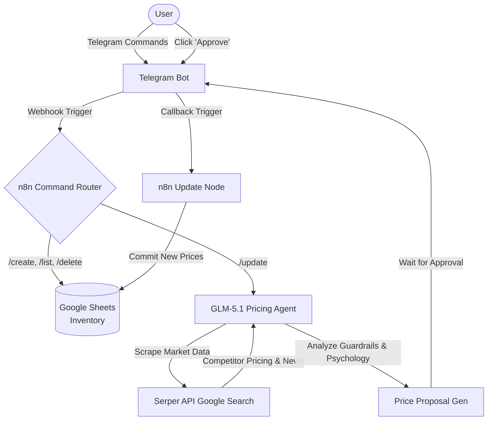

# TradeBridge ASEAN 🚀

An automated, AI-driven cross-border pricing engine designed for Malaysian SMEs expanding into ASEAN markets. 

Target User: Malaysian SMEs (e.g., F&B, retail, local manufacturers) looking to expand into ASEAN markets (Thailand, Indonesia, Philippines) via e-commerce platforms.

The Problem: SMEs lack the analytical power to price products across borders. They struggle with fluctuating exchange rates, hidden cross-border fees, localized purchasing power, and competitor pricing. They usually just apply a standard markup, which leads to lost sales or eroded margins.

Built with **n8n**, this system acts as a smart "Routing Brain." It listens to Telegram commands, scrapes real-time competitor pricing and macro trends via the Serper API, and uses GLM-5.1 to calculate optimal psychological pricing against hard profit floors. All data is synchronized seamlessly with Google Sheets.

## Features
* **Conversational UI:** Manage inventory and trigger price audits entirely via Telegram.
* **Autonomous Market Intelligence:** Searches local Shopee/Lazada prices and macro events (e.g., shortages, tariffs) in 9 ASEAN countries.
* **Anti-Seesaw Profit Guardrails:** Refuses to adjust prices if the market change is under 5% or drops below the hard floor cost margin.
* **Psychological Pricing Engine:** Automatically rounds to charm prices (e.g., 149 THB) or prestige prices for premium goods.
* **Human-in-the-Loop:** Sends a formatted proposal to Telegram for approval before modifying the production database.

## Prerequisites
* **Docker** installed on your machine (Mac, Windows, or Linux)
* Telegram Bot Token (via BotFather)
* Serper API Key
* GLM-5.1 API Key (via OpenAI-compatible endpoint)
* Google Cloud Console Project (with Sheets API enabled & OAuth2 credentials)

## Quick Start Deployment

⚠️ CRUCIAL NETWORKING WARNING: Telegram's Webhook architecture cannot send messages to a private localhost address. For the Telegram Trigger node to work, your n8n instance must be deployed and publicly accessible over the internet. You can achieve this by either:

1. Deploying the Docker container on a cloud VPS (e.g., DigitalOcean, AWS) with a public IP.
2. Running it locally but exposing your port 5678 to the internet using a tunneling service like ngrok or Cloudflare Tunnels.
3. This project uses a zero-config deployment approach. No environment files required—just spin up the container and plug in your keys via the UI.

### 1. Clone the repository
Pull the code directly from GitHub to get the workflow file and database template.
```bash
git clone https://github.com/jden-c/TradeBridge-ASEAN.git
cd TradeBridge-ASEAN
```

### 2. Spin up n8n
Run n8n locally using a single Docker command. This maps port 5678 and creates a local volume so your workflows save properly.
```bash
docker run -d --name n8n_tradebridge -p 5678:5678 -v n8n_data:/home/node/.n8n docker.n8n.io/n8nio/n8n
```

### 3. Import Workflow & Link Credentials
You will configure your external APIs directly inside the workflow nodes.

* Open your browser and go to `http://localhost:5678`.
* Go to **Workflows** -> **Import from File** and upload `TradeBridge_Workflow.json` from the cloned repository.
* **To add your credentials:** Double-click on the relevant nodes in the canvas. In the node settings panel, look for the **Credential** dropdown and select **Create New**:
    * **Telegram Nodes:** Create a new Telegram credential and paste your Bot Token.
    * **Google Sheets Nodes:** Create a new Google Sheets OAuth2 credential and authenticate with your account.
    * **GLM-5.1 (OpenAI) Nodes:** Create a new OpenAI credential and paste your GLM API key.
    * **Google Search (HTTP Request) Node:** Under Authentication, select "Generic Credential Type" -> "Header Auth". Create a new credential with the Name `X-API-KEY` and paste your Serper API Key as the Value.

### 4. Setup the Database
* Import the provided `inventory_schema_template.csv` into a blank Google Sheet. 
* Open the n8n workflow, double-click on all Google Sheets node, and paste the Document ID from your browser's URL bar to link your database.
* Click **Publish** in the top right corner of your workflow, and your bot is live!

---

## Telegram Commands
* `/create [Item Name], [Cost], [Local Price]` - Adds a new item to the database.
* `/setprice [Item Name], [Type], [Price]` - Manually override a regional price.
* `/delete [Item Name]` - Removes an item.
* `/list all` - Displays the full inventory.
* `/list [Item Name]` - Displays regional pricing for a specific item.
* `/update` - Triggers the GLM-5.1 engine to audit market trends and propose new pricing.

*Note: The user doesn't necessarily need to input commands perfectly according to the format, as there is an LLM router analyzing natural language and doing this job for them!*

## System Architecture


